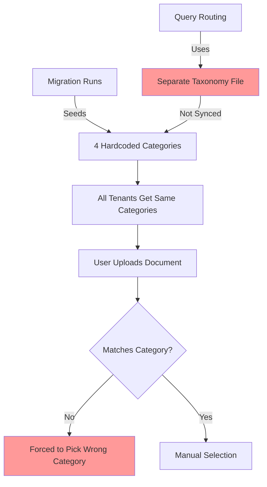
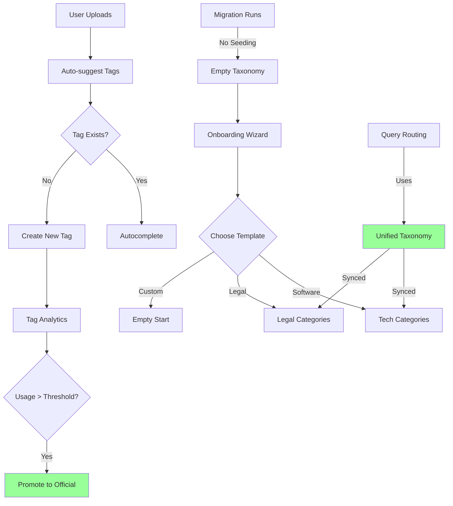

# Taxonomy System Refactor: Hybrid Controlled Vocabulary + Folksonomy

## Executive Summary

**Project**: Remove hardcoded taxonomy defaults and consolidate dual taxonomy systems
**Date**: October 5, 2025
**Status**: Planning Phase
**Priority**: HIGH - Improves maintainability and multi-tenant flexibility

---

## Problem Statement

The rag-multi-tenant system contains **two separate taxonomy implementations** with **hardcoded default categories** that make assumptions about tenant use cases. This creates:

1. **Forced categorization** - All tenants get 4 hardcoded categories (technical, creative, experience, personal) regardless of industry
2. **Dual taxonomy systems** - Document metadata taxonomy (`tenant_taxonomy`) and query routing taxonomy (`settings/taxonomy`) operate independently
3. **No folksonomy support** - Users cannot create free-form tags; all tags must match controlled vocabulary
4. **Limited discoverability** - No analytics for tag usage, no typo detection, no promotion workflow
5. **Maintenance burden** - Keeping two taxonomies in sync requires manual effort

### Real-World Impact

When a legal firm tenant uploads a case brief:

**Current Behavior (Limited):**
```
User Action: Upload "Smith-v-Jones-Brief.pdf"
System: "Select content type:"
  - Technical Documentation  ❌ Doesn't fit
  - Creative Content        ❌ Doesn't fit
  - Experience & Projects   ❌ Doesn't fit
  - Personal Information    ❌ Doesn't fit
User: *Forced to pick "Technical Documentation"* ❌
```

**Expected Behavior:**
```
User Action: Upload "Smith-v-Jones-Brief.pdf"
System: "Select content type (or create new):"
  - Legal Brief            ✅ Tenant-created category
  - Contract               ✅ From legal template
  - [+ Create new type]    ✅ Folksonomy
User: *Picks "Legal Brief"* ✅
System: Auto-suggests tags: "litigation", "civil-law" (from existing corpus)
```

---

## Audit Results

### Taxonomy System Inventory

| System | Location | Purpose | Tenant-Scoped | Editable |
|--------|----------|---------|---------------|----------|
| **Document Metadata** | `tenant_taxonomy` table | Upload/edit dropdowns, LLM inference mapping | ✅ Yes | ✅ Via API |
| **Query Routing** | `admin_settings` table + `topic_taxonomy.json` | Query intent detection, content routing | ❌ No (shared) | ✅ Via API |

### Hardcoded Defaults Inventory

#### Migration Seeding (`backend/db/versions/20251005_070529_add_document_metadata.py`)

```sql
-- Lines 210-249: Hardcoded for ALL tenants with slug='default'
INSERT INTO tenant_taxonomy (tenant_id, key, label, synonyms)
VALUES
  ('technical', 'Technical Documentation', '["documentation", "docs", "guide"]'),
  ('experience', 'Experience & Projects', '["portfolio", "work", "projects"]'),
  ('creative', 'Creative Content', '["blog", "writing", "article"]'),
  ('personal', 'Personal Information', '["bio", "about", "resume"]');
```

**Issues:**
- ❌ Assumes personal website use case
- ❌ Blocks legal, medical, manufacturing, education tenants
- ❌ Cannot skip/customize during onboarding

#### LLM Inference Fallback (`backend/core/metadata_inference.py`)

```python
# Lines 137-142: Duplicates migration defaults
if not taxonomy:
    taxonomy = {
        "technical": {"label": "Technical Documentation", ...},
        "experience": {"label": "Experience & Projects", ...},
        "creative": {"label": "Creative Content", ...},
        "personal": {"label": "Personal Information", ...},
    }
```

**Issues:**
- ❌ Duplication with migration
- ❌ Hardcoded assumptions
- ❌ No empty state handling

#### Query Routing Fallback (`backend/core/topic_taxonomy.json`)

```json
{
  "categories": {
    "experience": {"synonyms": ["experience", "work", "job", "role"], ...},
    "skills": {"synonyms": ["skill", "technology", "expertise"], ...},
    "projects": {"synonyms": ["project", "built", "created"], ...}
  }
}
```

**Issues:**
- ❌ Not tenant-scoped (shared across all tenants)
- ❌ Different structure than `tenant_taxonomy`
- ❌ Requires manual sync with document taxonomy

---

## Architecture Issues

### Issue #1: Dual Taxonomy Systems

```
┌──────────────────────────────────────────────┐
│ System #1: Document Metadata                 │
│ ├─ Table: tenant_taxonomy                    │
│ ├─ Purpose: Upload/edit dropdowns            │
│ ├─ Format: {key, label, synonyms, active}    │
│ ├─ Tenant-scoped: YES ✅                      │
│ └─ Used by: upload UI, metadata editor       │
└──────────────────────────────────────────────┘

┌──────────────────────────────────────────────┐
│ System #2: Query Routing (LEGACY)            │
│ ├─ Storage: admin_settings + file fallback   │
│ ├─ Purpose: Query intent detection           │
│ ├─ Format: {categories: {name: {regex}}}     │
│ ├─ Tenant-scoped: NO ❌                       │
│ └─ Used by: content_router, classifier       │
└──────────────────────────────────────────────┘

          ↓ Result ↓
  - Vocabulary drift (sync burden)
  - Confusion (which to edit?)
  - No unified analytics
```

### Issue #2: No Folksonomy Support

**Missing Capabilities:**

| Feature | Current | Industry Standard |
|---------|---------|-------------------|
| User-created tags | ❌ No | ✅ Confluence, Notion, SharePoint |
| Tag autocomplete | ❌ No | ✅ From existing corpus |
| Tag analytics | ❌ No | ✅ Frequency, co-occurrence |
| Tag promotion | ❌ No | ✅ User tags → official taxonomy |
| Typo detection | ❌ No | ✅ Fuzzy matching |
| Tag suggestions | ❌ No | ✅ ML-based recommendations |

**Impact:**
- Users can't innovate (must request admin to add categories)
- No natural vocabulary evolution
- Typos create duplicate tags (`python` vs `pythn`)

### Issue #3: No Template/Onboarding System

**Current State:**
```
New Tenant Created
  ↓
Taxonomy auto-seeded with 4 generic categories
  ↓
❌ Law firm gets "Creative Content"
❌ Hospital gets "Experience & Projects"
❌ No way to skip or customize
```

**Industry Standard (Microsoft, Notion):**
```
New Tenant Created
  ↓
Onboarding wizard:
  "Choose a template:"
  - [ ] Software Documentation
  - [ ] Legal Documents
  - [ ] Medical Records
  - [X] Start from scratch
  ↓
Pre-populated with sensible defaults
  ↓
✅ Editable in-UI
✅ Can add/remove categories
```

---

## Impact Analysis

### Current State Flow



### Target State Flow



---

## Success Criteria

### Functional Requirements

1. ✅ No hardcoded category defaults (optional templates instead)
2. ✅ Single unified taxonomy system (consolidate dual systems)
3. ✅ User-created tags supported (folksonomy)
4. ✅ Tag promotion workflow (user tags → official taxonomy)
5. ✅ Onboarding template system (industry-specific)
6. ✅ Tag analytics dashboard (frequency, typos, co-occurrence)

### Technical Requirements

1. ✅ Backward compatible (existing tenants unaffected)
2. ✅ Database migration adds required columns
3. ✅ Legacy query routing migrated to unified taxonomy
4. ✅ All tests pass after refactor
5. ✅ API endpoints remain unchanged (internal refactor only)

### User Experience Requirements

1. ✅ New tenants choose template OR start empty
2. ✅ Existing tenants keep their categories
3. ✅ Tag autocomplete from existing corpus
4. ✅ In-UI taxonomy management (no SQL required)
5. ✅ Visual indicators for official vs user-created tags

---

## Risk Assessment

### High Risk

| Risk | Impact | Mitigation |
|------|--------|------------|
| **Migration failure** | Data loss for existing tenants | Dry-run testing, rollback script |
| **Query routing breaks** | Search accuracy degrades | Gradual migration, feature flag |
| **LLM prompt changes** | Inference accuracy drops | A/B testing, confidence monitoring |

### Medium Risk

| Risk | Impact | Mitigation |
|------|--------|------------|
| **Tag spam** | Users create too many tags | Usage thresholds, admin review UI |
| **API contract changes** | Breaks existing clients | Versioning, deprecation warnings |
| **Performance degradation** | Tag autocomplete slows down | Caching, indexed queries |

### Low Risk

| Risk | Impact | Mitigation |
|------|--------|------------|
| **UI confusion** | Users don't understand new features | Onboarding tooltips, documentation |
| **Template mismatch** | Template doesn't fit tenant | Easy to edit/delete after bootstrap |

---

## Phases Overview

### Phase 1: Remove Hardcoded Defaults (Quick Win)
- Remove migration seeding
- Add optional template system
- Create onboarding flow

**Effort**: 1 week
**Impact**: New tenants get customization

### Phase 2: Consolidate Taxonomies (Architecture Fix)
- Migrate query routing to use `tenant_taxonomy`
- Add regex column for pattern matching
- Deprecate legacy settings/taxonomy

**Effort**: 1 week
**Impact**: Single source of truth

### Phase 3: Add Folksonomy Support (Feature Enhancement)
- Allow user-created tags
- Build tag analytics
- Implement promotion workflow

**Effort**: 2 weeks
**Impact**: Natural vocabulary evolution

### Phase 4: Template Library & Polish (UX Enhancement)
- Industry-specific templates
- Tag suggestions
- Typo detection

**Effort**: 1 week
**Impact**: Professional onboarding

---

## Metrics for Success

### Before Refactor

```
Taxonomy Metrics (Current State)
├─ Tenants with default categories: 100%
├─ User-created categories: 0 (not supported)
├─ Tag duplication rate: Unknown (no analytics)
├─ Category coverage: 85% (15% "unknown")
├─ Taxonomy systems: 2 (requires sync)
└─ Onboarding time: 0 min (auto-seeded)
```

### After Refactor

```
Taxonomy Metrics (Target State)
├─ Tenants with customized categories: >60%
├─ User-created tags per tenant: avg 10-20
├─ Tag duplication rate: <5% (fuzzy matching)
├─ Category coverage: >95% (better fit)
├─ Taxonomy systems: 1 (unified)
└─ Onboarding time: 2-3 min (template selection)
```

---

## Related Documents

- `02-implementation-plan.md` - Detailed phase-by-phase implementation
- `03-database-schema.md` - Schema changes and migrations
- `04-api-changes.md` - New endpoints and modifications
- `05-ui-changes.md` - Frontend component updates
- `06-testing-strategy.md` - Test cases and validation
- `07-migration-guide.md` - Step-by-step execution guide

---

## References

### Industry Standards

- **Microsoft SharePoint**: Managed Metadata + Enterprise Keywords (hybrid approach)
- **Confluence**: Controlled labels + user tags with autocomplete
- **Notion**: Database properties + tag suggestions
- **BBC**: Social tagging promoted to formal taxonomy

### Research Sources

- _"Taxonomies and controlled vocabularies best practices"_ (Springer, Journal of DAM)
- _"Know Your RAG: Dataset Taxonomy and Generation Strategies"_ (arXiv 2024)
- _"Metadata: Folksonomy and the Art of Tagging in the Enterprise"_ (Formtek)
- _"Taxonomy 101: Best Practices"_ (Nielsen Norman Group)

---

## Next Steps

1. ✅ Review this overview document
2. ⏭️ Read `02-implementation-plan.md` for detailed tasks
3. ⏭️ Review `03-database-schema.md` for migration specs
4. ⏭️ Approve and begin Phase 1 implementation
5. ⏭️ Execute in phases with validation between each

---

**Document Version**: 1.0
**Last Updated**: 2025-10-05
**Author**: Architecture Review Team
